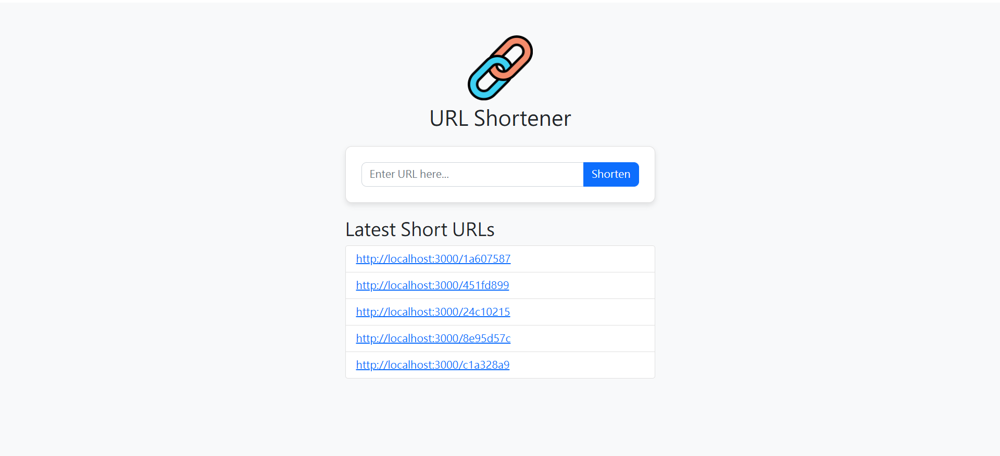

# ShortURL - URL Shortener

ShortURL is a simple URL shortener built with Node.js, Express, and MongoDB. It allows users to shorten long URLs, view the latest five shortened URLs, and display an image on the webpage.

## Features

- Shorten a long URL
- Retrieve the latest five shortened URLs
- Display an image on the webpage


## Project Structure

```
shorturl/
├── public/               # Static files (CSS, JS, Images)
├── views/                # Handlebars templates
├── routes/               # Express route handlers
├── models/               # Mongoose schemas
├── helpers/              # Helper functions (e.g., URL shortener)
├── app.js                # Main application file
├── package.json          # Dependencies and scripts
└── README.md             # Project documentation
```

## Technologies Used

- Node.js
- Express.js
- MongoDB (Mongoose)
- Handlebars (view engine)
- Bootstrap (for styling)

## Screenshot



